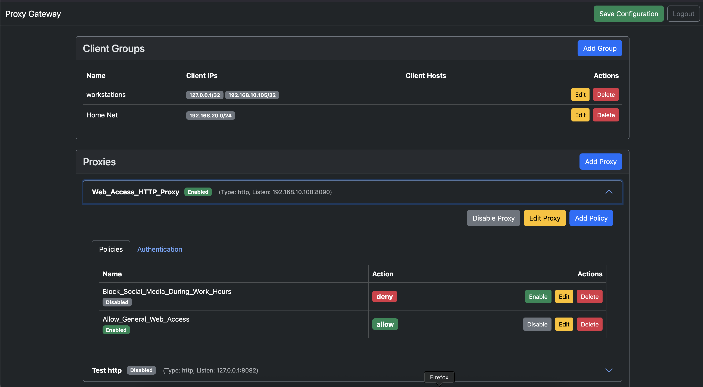

# Proxy Gateway

A flexible and configurable proxy server.

## Features

*   **HTTP Proxy:** A standard HTTP proxy with optional authentication.
*   **SOCKS5 Proxy:** A SOCKS5 proxy with optional authentication.
*   **UDP Proxy:** A stateful UDP proxy.
*   **mDNS Reflector:** A multicast DNS reflector for cross-VLAN service discovery.
*   **Web UI:** A web-based user interface for configuration, with support for OIDC authentication.
*   **Policy Engine:** A policy engine to control access to the proxies.
*   **DNS Resolver:** A DNS resolver with support for upstream servers, blocked hosts, and custom records.

## Building

To build the proxy gateway from source, you need to have Go installed. You can then run the following command to build the binary:

```
go build -o proxy-gateway ./cmd/gateway
```

## Running

Once you have built the binary, you can generate a default configuration file:

```
./proxy-gateway -generate-config > config.yaml
```

Then, you can run the proxy gateway with the following command:

```
./proxy-gateway -config config.yaml
```

## Configuration

The proxy server is configured using a YAML file. An example configuration file is provided as `config.yaml`. The configuration is split into the following main sections:

*   `log_level`: "debug", "info", "warn", "error", "fatal", "panic"
*   `web_address`: Address and port for the web UI.
*   `session_secret_key`: A secret key for session management.
*   `tls`: Configuration for automatic TLS certificates using ACME.
*   `self_signed`: Configuration for self-signed TLS certificates.
*   `dns`: Configuration for the DNS resolver.
*   `proxies`: A list of proxy configurations (HTTP, SOCKS5, etc.).
*   `oidc`: Configuration for OpenID Connect (OIDC) authentication for the web UI.
*   `groups`: Definitions of client groups for use in policies.

For a detailed explanation of all configuration options, please refer to the comments in the `config.yaml` file.

## Web GUI

The proxy gateway provides a web-based user interface for configuration.



## Releases

Pre-built binaries for Linux, Windows, and macOS are available on the [GitHub Releases](https://github.com/vidhun/proxy-gateway/releases) page.